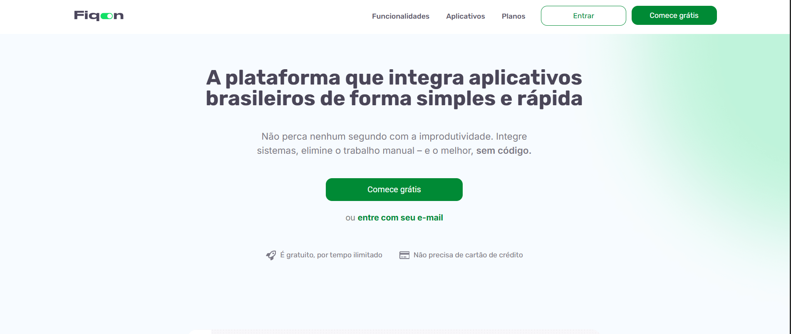

# Fiqon Site

## Description
This is a custom WordPress website developed for Fiqon. The project focused on responsive design, performance optimization, and user-friendly content management.

## Technologies Used
- WordPress
- Elementor
- Advanced Custom Fields (ACF)
- Custom Post Types

## Live Preview
https://fiqon.com.br/

## My Role
- Full website development
- Performance and SEO optimization
- Third-party tool integration
- Content structure and customization
- Custom Theme

## Notes
Source code is not publicly available due to client confidentiality, but I'm happy to discuss the development process.
